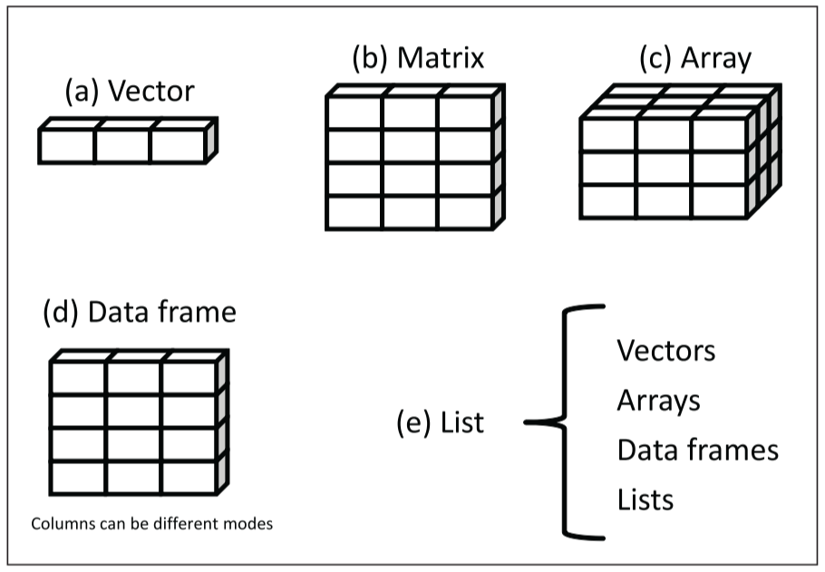
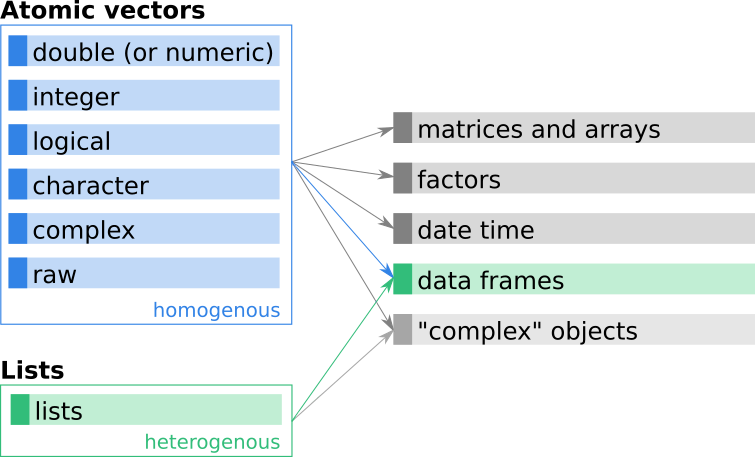
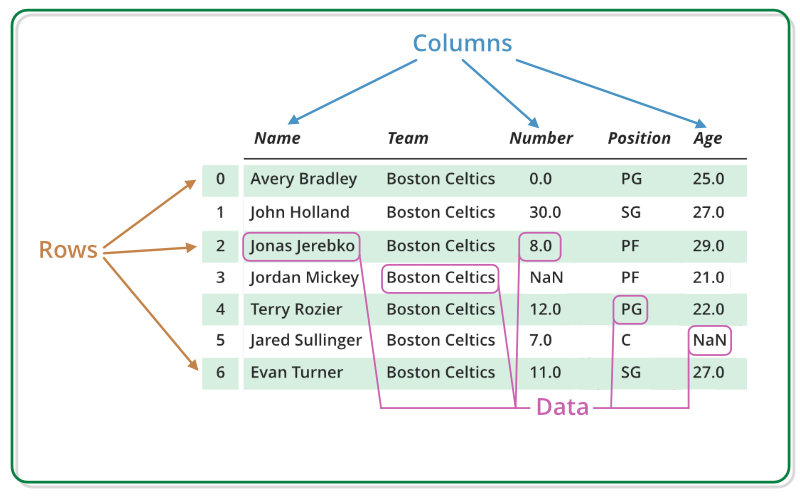
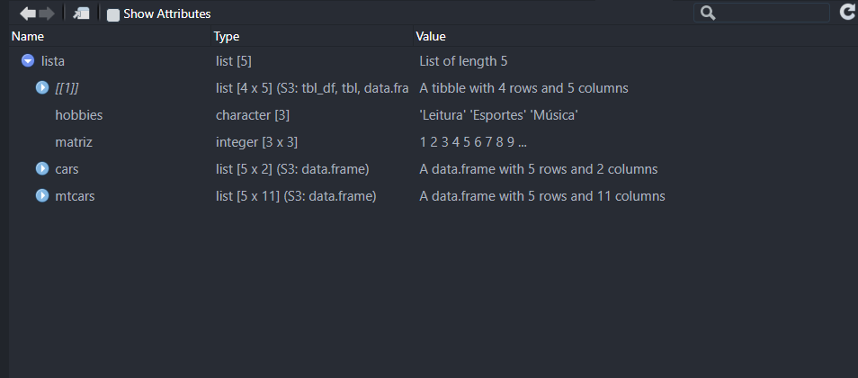

# 01 - Introdução ao R e pensamento com dados {style="font-size:1.5em;"}

# O que é análise de dados? {.center .nonincremental}

- Rodar o código, fazer um gráfico ou só calcular estatísticas para formalizar seu resultado?
  - Nenhum dos três de forma isolada. **É transformar dados em respostas.**

- *“É muito melhor uma resposta aproximada à pergunta certa, que muitas vezes é vaga, do que uma resposta exata à pergunta errada, que sempre pode ser tornada precisa. (John Tukey)”*

# Exemplo de análise de dados (Case 1) {.center .nonincremental}

::: {style="text-align: center; margin-top: 1em"}
::: {.fragment .fade-in-then-semi-out}
<div style="text-align: center;">
{height="500"}
<div style="margin-top: 2px; font-size: 0.6em; color: gray;">
Fonte: @wilher2023analise.
</div>
</div>
:::
:::

# Exemplo de análise de dados (Case 2) {.center .nonincremental}

::: {style="text-align: center; margin-top: 1em"}
::: {.fragment .fade-in-then-semi-out}
{height="500"}
:::
:::

# O papel do R {.center .nonincremental}

- Onde entra o R nisso?

::: {style="text-align: center; margin-top: 1em"}
::: {.fragment .fade-in-then-semi-out}
<div style="text-align: center;">
{height="350"}
<div style="margin-top: 2px; font-size: 0.6em; color: gray;">
Fonte: @wickham2023r.
</div>
</div>
:::
:::

# Por que economistas usam R {.center .nonincremental}

- Trabalha bem com grandes bases;
- É completamente gratuito e *open source*;
- Muito utilizado pela comunidade acadêmica e pelo mercado;
- Possui uma comunidade ativa que **desenvolve e compartilha pacotes**;
- Permite replicação de resultados;
- E o principal: **Permite contar histórias com dados!**

# O que é o RStudio? {.center .nonincremental}

-   Ambiente de Desenvolvimento Integrado (IDE);
    -   RStudio é um ambiente de desenvolvimento integrado projetado especificamente para trabalhar com a linguagem R.
-   Suas vantagens.
    -   Facilita o desenvolvimento e análise de código R com recursos como edição de scripts, **gerenciamento de projetos e depuração integrada**.

# Passos da instalação {.center}

::: columns
::: {.column width="50%"}
::: {.fragment .fade-in-then-semi-out}
Visite [CRAN - The Comprehensive R Archive Network](https://cran.rstudio.com/) e baixe a linguagem, através de um arquivo executável, para seu sistema operacional;
:::

::: {.fragment .fade-in-then-semi-out}
Visite [RStudio Desktop](https://posit.co/download/rstudio-desktop/) e baixe o instalador para seu sistema operacional;
:::

::: {.fragment .fade-in}
<p style="color: #028DB7">
Siga as instruções fornecidas nos instaladores para completar o processo de instalação.
</p>
:::
:::

::: {.column width="50%"}
{.absolute height="150"}\
{.absolute height="200" bottom="50px"}
:::
:::

# RStudio Cloud {.center .nonincremental}

::: columns
::: {.column width="50%"}
::: {.fragment .fade-in-then-semi-out}
Visite a [Posit Cloud](https://posit.cloud/) para acessar e utilizar o RStudio sem a necessidade de instalação local;
:::

::: {.fragment .fade-in}
<p style="color: #028DB7">
Necessário realizar **login** (através de uma conta Google, Github, entre outros) para acessar o RStudio Cloud.
</p>
:::
:::

::: {.column width="50%"}
{.absolute .border .shadow-border height="300" width="600"}
:::
:::

# Interface do RStudio {.center .nonincremental}

::: {style="text-align: center; margin-top: 1em"}
::: {.fragment .fade-in-then-semi-out}
{.border .shadow-border height="500"}
:::
:::

# Vamos à prática! {style="font-size:1.5em;"}

# Exercício de Fixação {.center .center-x background-color="#00263A"}

1. Considere os dados de uma empresa que vende 4 produtos:

::: fragment
```{r}
preco <- c(10, 20, 15, 30)
quantidade <- c(100, 50, 80, 40)
custo <- c(800, 600, 900, 1250)
```
:::

(a) Calcule a receita de cada produto
(b) Calcule o lucro de cada produto
(c) Mostre quais produtos tiveram lucro positivo
(d) Qual produto teve maior lucro?
(e) Existe algum produto que deu prejuízo?

2. Substitua os lucros negativos por 0 (como se a empresa ignorasse prejuízo)

# 02 - Estruturas de dados e funções básicas {style="font-size:1.5em;"}

#  {.center .nonincremental}
::: {style="text-align: center; margin-top: 1em"}
{height="500"}
:::

# Como os dados aparecem na economia {.center .nonincremental}

- Séries de valores (ex: PIB ao longo do tempo)
- Séries temporais (inflação, taxa de juros, desemprego)
- Tabelas com múltiplas variáveis (PIB, emprego, crédito por município)
- Bases com diferentes indicadores (social, econômico, ambiental)
- Dados por região (país, estado)
- Dados por setor (indústria, serviços, agropecuária, entre outros)

# E o que podemos fazer com esses dados {.center .nonincremental}

- Calcular médias e medianas
- Identificar máximos e mínimos
- Criar novas variáveis
- Comparar informações 
- Agrupar dados
- A ideia central é **transformar dados brutos em informação econômica**

# Tipos de estruturas de dados {.center .noincremental}

::: columns
::: {.column width="50%"}
::: {.fragment .fade-in-then-semi-out}
Na linguagem R, há várias estruturas de dados fundamentais que são usadas para armazenar e manipular informações de maneiras específicas.
:::

-   **Vetores**: Unidimensionais;
-   **Matrizes**: Bidimensionais;
-   **Data Frames**: Bidimensionais;
-   **Arrays**: Multidimensionais;
-   **Listas**: Flexíveis.
:::

::: {.column width="50%"}
{.absolute .border .shadow-border width="500" heigth="500"}
:::
:::

# Tipos de estruturas de dados {.center .nonincremental visibility="uncounted"}

::: {style="text-align: center; margin-top: 1em"}
{height="400"}
:::

# Principais classes de dados {.center .noincremental}

::: columns
::: {.column width="30%"}
-   numeric;
-   integer;
-   character;
-   logical;
-   complex;
-   raw;
-   list.
:::

::: {.column width="70%"}
::: fragment
Quando se mistura diferentes tipos de dados em uma operação, o R usa uma **hierarquia de coerção** para determinar como converter **estes dados**.

::: {.fragment .center-text}
logical ➡ integer ➡ numeric ➡ complex ➡ character
:::
:::
:::
:::

# O que são data frames? {.center .noincremental}

- Os *data frames* são estruturas de dados fundamentais no R, muito utilizadas para **armazenar conjuntos de dados tabulares**, onde as colunas podem conter **diferentes tipos de classes** (numéricos, caracteres, lógicos, etc.).

-   Quanto a sua estrutura, temos:
    -   **Nome das Colunas (variáveis):** Cada coluna em um *data frame* tem um nome que a identifica, representando seus respectivos atributos;
    -   **Rótulos de Linhas (observações):** As linhas podem ser rotuladas para identificar cada observação de maneira única ou significativa.

# O que são data frames? {.center visibility="uncounted"}

::: {style="text-align: center; margin-top: 1em"}
{height="450"}
:::

# Dados nativos do R

O R vem com vários conjuntos de *data frames* nativos, que estão disponíveis para **uso imediato**. Esses conjuntos de dados são fornecidos principalmente pelo pacote `datasets`, que é **carregado automaticamente quando você inicia uma sessão R**.

::: fragment
Você pode listar todos os conjuntos de dados disponíveis no pacote `datasets` usando a função `data()`.

```{r, results='hide', eval=FALSE}
data(package = "datasets")
```
:::

-   Principais conjuntos de dados:
    -   airquality
    -   mtcars
    -   cars
    -   iris

# Dados brasileiros

- **sidrar**: IBGE *(PIB, população, produção, etc.)*  
- **rbcb**: Banco Central *(juros, crédito, inflação)*  
- **ipeadatar**: indicadores econômicos (IPEA)  
- **basedosdados**: diversas bases públicas organizadas *(IBGE, BCB, RAIS, etc.)*  
- **pnadcIBGE**: microdados da PNAD Contínua *(mercado de trabalho)*  
- **microdatasus**: dados de saúde *(DATASUS)*  
- **censobr**: Censo demográfico  
- **geobr**: dados espaciais do Brasil *(mapas, municípios)* 

# Dados internacionais

- **WDI**: Banco Mundial *(PIB, pobreza, educação)*  
- **gapminder**: desenvolvimento global *(didático)*  
- **oecd** / APIs: indicadores econômicos de países  
- **IMFData**: Fundo Monetário Internacional *(macro global)*  
- **tidyquant**: dados financeiros *(mercados, ações)*  
- **quantmod**: séries financeiras *(Yahoo Finance, etc.)*  
- **fredr**: Federal Reserve *(EUA: juros, inflação, desemprego)*  

# Listas no R 

- Permitem guardar **diferentes tipos de dados juntos**  
- Podem conter vetores, data frames e até outros objetos, ou seja, são úteis quando trabalhamos com **múltiplas bases ou resultados**

- Então temos:
  - **Vetor**: uma única informação 
  - **Data frame**: várias informações organizadas  
  - **Lista**: vários objetos diferentes reunidos 

# Criando listas {.center visibility="uncounted"}

- Dessa forma, a lista criada estará em um formato parecido com esse:

::: fragment
::: {style="text-align: center;"}
{.border .shadow-border height="450"}
:::
:::

# Vamos à prática! {style="font-size:1.5em;"}

# Exercício de Fixação (Aula 02) {.center .center-x background-color="#00263A"}

1. Utilizando o objeto `paises`, responda:

```{r, echo = FALSE}
library(tidyverse)
```

::: fragment
```{r}
paises <- tibble(
  pais = c("Brasil", "Argentina", "Chile", "Peru"),
  pop = c(203, 46, 19, 34),
  desemprego = c(7.8, 6.5, 8.7, 7.2),
  pib = c(2174, 633, 335, 268)
)
```
:::

(a) Mostre apenas as colunas pais e pib.
(b) Mostre apenas os países com pib maior que 300.
(c) Crie uma nova coluna chamada pib_percapita, que representa a divisão do pib pela população
(d) Crie uma nova coluna chamada desemprego_alto, que deve ser: TRUE para desemprego maior que 7 e FALSE caso contrário
(e) Altere o valor do desemprego do Chile para 8 e remova a coluna pop

# Exercício de Fixação (Aula 02) {.center .center-x background-color="#00263A"}

2. Na lista lista_econ:

::: fragment
```{r}
lista_econ <- list(
  paises = paises,
  codigos = c("Brasil" = "BRA", 
              "Argentina" = "ARG", 
              "Chile" = "CHL", 
              "Peru" = "PER"),
  anos = c(2021, 2022, 2023, 2024)
)
```
:::

(a) Modifique, dentro da lista, o código do Peru de "PER" para "PRU"

# Referências {.unnumbered}

::: {#refs}
:::