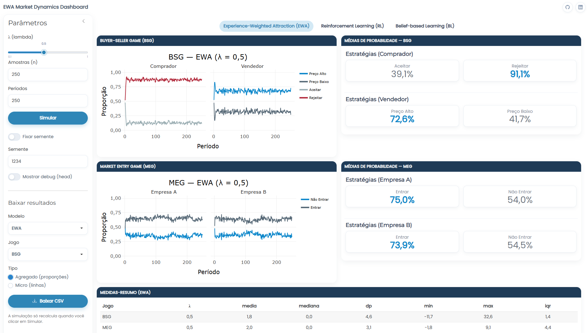
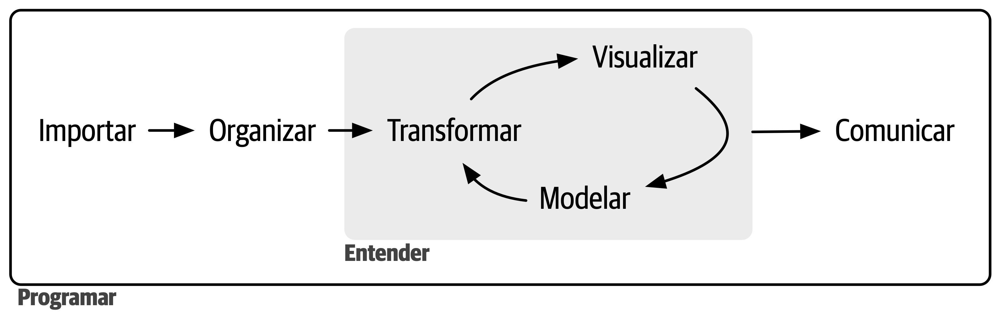
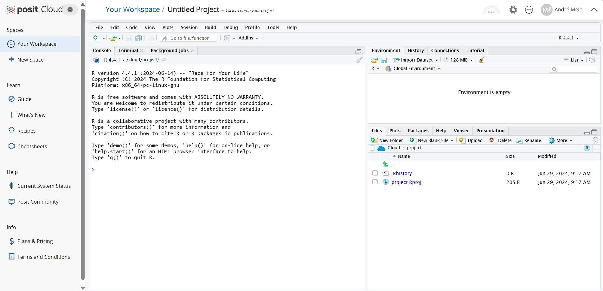
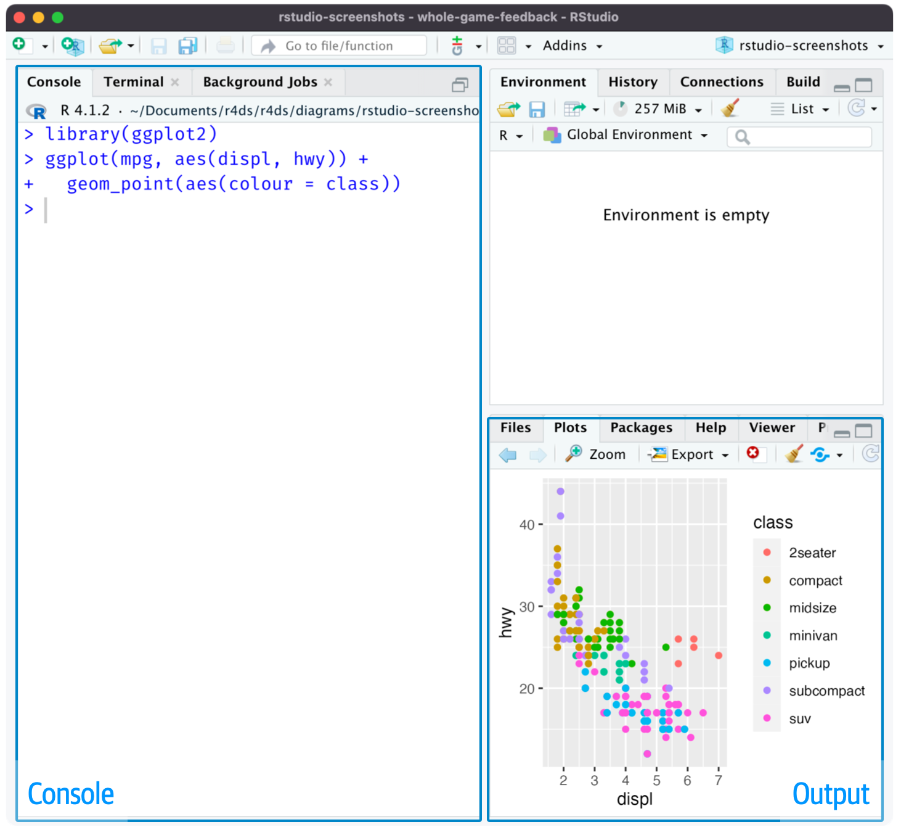

# Introdução ao R e pensamento com dados {style="font-size:1.5em;"}

# O que é análise de dados? {.center .nonincremental}

- Rodar o código, fazer um gráfico ou só calcular estatísticas para formalizar seu resultado?
  - Nenhum dos três de forma isolada. **É transformar dados em respostas.**

- *“É muito melhor uma resposta aproximada à pergunta certa, que muitas vezes é vaga, do que uma resposta exata à pergunta errada, que sempre pode ser tornada precisa. (John Tukey)”*

# Exemplo de análise de dados (Case 1) {.center .nonincremental}

::: {style="text-align: center; margin-top: 1em"}
::: {.fragment .fade-in-then-semi-out}
<div style="text-align: center;">
{height="500"}
<div style="margin-top: 2px; font-size: 0.6em; color: gray;">
Fonte: @wilher2023analise.
</div>
</div>
:::
:::

# Exemplo de análise de dados (Case 2) {.center .nonincremental}

::: {style="text-align: center; margin-top: 1em"}
::: {.fragment .fade-in-then-semi-out}
{height="500"}
:::
:::

# O papel do R {.center .nonincremental}

- Onde entra o R nisso?

::: {style="text-align: center; margin-top: 1em"}
::: {.fragment .fade-in-then-semi-out}
<div style="text-align: center;">
{height="350"}
<div style="margin-top: 2px; font-size: 0.6em; color: gray;">
Fonte: @wickham2023r.
</div>
</div>
:::
:::

# Por que economistas usam R {.center .nonincremental}

- Trabalha bem com grandes bases;
- É completamente gratuito e *open source*;
- Muito utilizado pela comunidade acadêmica e pelo mercado;
- Possui uma comunidade ativa que **desenvolve e compartilha pacotes**;
- Permite replicação de resultados;
- E o principal: **Permite contar histórias com dados!**

# O que é o RStudio? {.center .nonincremental}

-   Ambiente de Desenvolvimento Integrado (IDE);
    -   RStudio é um ambiente de desenvolvimento integrado projetado especificamente para trabalhar com a linguagem R.
-   Suas vantagens.
    -   Facilita o desenvolvimento e análise de código R com recursos como edição de scripts, **gerenciamento de projetos e depuração integrada**.

# Passos da instalação {.center}

::: columns
::: {.column width="50%"}
::: {.fragment .fade-in-then-semi-out}
Visite [CRAN - The Comprehensive R Archive Network](https://cran.rstudio.com/) e baixe a linguagem, através de um arquivo executável, para seu sistema operacional;
:::

::: {.fragment .fade-in-then-semi-out}
Visite [RStudio Desktop](https://posit.co/download/rstudio-desktop/) e baixe o instalador para seu sistema operacional;
:::

::: {.fragment .fade-in}
<p style="color: #028DB7">
Siga as instruções fornecidas nos instaladores para completar o processo de instalação.
</p>
:::
:::

::: {.column width="50%"}
{.absolute height="150"}\
{.absolute height="200" bottom="50px"}
:::
:::

# RStudio Cloud {.center .nonincremental}

::: columns
::: {.column width="50%"}
::: {.fragment .fade-in-then-semi-out}
Visite a [Posit Cloud](https://posit.cloud/) para acessar e utilizar o RStudio sem a necessidade de instalação local;
:::

::: {.fragment .fade-in}
<p style="color: #028DB7">
Necessário realizar **login** (através de uma conta Google, Github, entre outros) para acessar o RStudio Cloud.
</p>
:::
:::

::: {.column width="50%"}
{.absolute .border .shadow-border height="300" width="600"}
:::
:::

# Interface do RStudio {.center .nonincremental}

::: {style="text-align: center; margin-top: 1em"}
::: {.fragment .fade-in-then-semi-out}
{.border .shadow-border height="500"}
:::
:::

# Vamos à prática! {style="font-size:1.5em;"}

# Exercício de Fixação {.center .center-x background-color="#00263A"}

1. Considere os dados de uma empresa que vende 4 produtos:

::: fragment
```{r}
preco <- c(10, 20, 15, 30)
quantidade <- c(100, 50, 80, 40)
custo <- c(800, 600, 900, 1250)
```
:::

(a) Calcule a receita de cada produto
(b) Calcule o lucro de cada produto
(c) Mostre quais produtos tiveram lucro positivo
(d) Qual produto teve maior lucro?
(e) Existe algum produto que deu prejuízo?

2. Substitua os lucros negativos por 0 (como se a empresa ignorasse prejuízo)

# Referências {.unnumbered}

::: {#refs}
:::