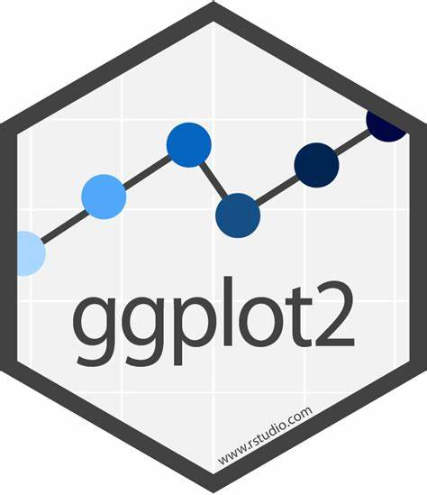

# 01 - Fundamentos do ggplot2 e construção de gráficos {style="font-size:1.5em;"}

# Introdução ao ggplot2 {.center}

::: {.fragment .fade-in-then-semi-out}
O `ggplot2` é um dos pacotes mais populares para visualização de dados no R, criado por Hadley Wickham. Ele implementa a gramática de gráficos, permitindo a criação de **visualizações complexas de forma intuitiva e flexível**.
:::

::: fragment
::: columns
::: {.column width="50%"}
A gramática de gráficos (*Grammar of Graphics*) é um conceito que descreve e constrói gráficos através de componentes básicos.
:::

::: {.column width="50%"}
{.absolute height="450"}
:::
:::
:::

# Princípios básicos do ggplot2 {.center}

::: columns
::: {.column width="50%"}
-   **Data**:
    -   O primeiro passo na construção de um gráfico é fornecer os dados.
-   **Aesthetics** (`aes`):
    -   Especifica como os dados são mapeados visualmente
-   **Geometries** (`geoms`):
    -   Define o tipo de gráfico a ser criado, como pontos, barras, linhas, caixas, etc.
:::

::: {.column width="50%"}
-   **Facets**:
    -   Permite dividir os dados em subgráficos baseados em uma ou mais variáveis.
-   **Scales**:
    -   Controla a mapeamento das variáveis para as estéticas, incluindo eixos e legendas.
-   **Themes**:
    -   Modifica a aparência geral do gráfico, como cores de fundo, fontes, etc.
:::
:::

# Princípios básicos do ggplot2 {.center visibility="uncounted"}

::: {style="text-align: center; margin-top: 1em"}
{.border .shadow-border height="500"}
:::

# Processo de camada (layers) {.center}

No `ggplot2`, é possível desenvolver gráficos camada por camada. Cada camada adiciona novos elementos ou modifica os existentes. A seguir, utilizaremos a base `mtcars`.

Porém, antes é necessário ativarmos o pacote.
```{r}
library(ggplot2)
```


# Camada de Dados e Aesthetics {.center}

```{r}
p <- ggplot(data = mtcars, aes(x = wt, y = mpg))
```

```{r, echo=FALSE, fig.align='center'}
p
```

# Camada de Geometria {.center}

```{r}
p <- p + geom_point()
```

```{r, echo=FALSE, fig.align='center'}
p
```

# Camada de Facets (Opcional) {.center}

```{r}
p <- p + facet_wrap(~ cyl)
```

```{r, echo=FALSE, fig.align='center'}
p
```

# Camada de Facets (Opcional) {.center}

```{r}
p <- p + scale_x_continuous(breaks = seq(0, 6, by = 1))
```

```{r, echo=FALSE, fig.align='center'}
p
```

# Camada de Themes (Opcional) {.center}

```{r}
p <- p + theme_minimal()
```

```{r, echo=FALSE, fig.align='center'}
p
```

# ggsave {.center}

Para gráficos gerados com `ggplot2`, podemos salvá-los em formato *png*, *jpeg* e *pdf*. Neste caso, salvaremos nesses 3 formatos diretamente para a pasta `figuras`.

```{r, eval=FALSE}
# Salvar em PNG
ggsave("figuras/figura1.png", plot = p, width = 6, height = 4, dpi = 300)

# Salvar em JPEG
ggsave("figuras/figura2.jpeg", plot = p, width = 6, height = 4)

# Salvar em PDF
ggsave("figuras/figura2.pdf", plot = p, width = 6, height = 4)
```


# Exercício de Fixação 01 {.center .center-x background-color="#00263A"}

::: {.fragment}
A base utilizada foi construída com séries temporais do Banco Central do Brasil, obtidas pelo pacote *rbcb*.

::: {.fragment}
O objetivo é analisar a relação entre juros e comprometimento da renda das famílias no Brasil entre 2016 e fevereiro de 2026.
:::

::: {.fragment}
As variáveis disponíveis na base são:
:::

- `selic`: taxa Selic;
- `atraso_pf`: atraso da carteira de crédito para pessoa física;
- `comprometimento_renda`: comprometimento da renda das famílias com dívidas;
- `endividamento_familias`: endividamento das famílias.
:::

# Exercício de Fixação 01 {.center .center-x background-color="#00263A"}

::: {.fragment}
Pressuposto econômico: juros mais altos tornam o crédito mais caro. Isso pode aumentar o valor das parcelas e fazer com que uma parte maior da renda das famílias seja usada para pagar dívidas.
:::

::: {.fragment}
Pergunta-se:

Em períodos de Selic alta, o comprometimento da renda das famílias também é maior?

Construa um gráfico de linhas comparando a média anual da selic e do `comprometimento_renda`. Para facilitar a visualização, calcule primeiro a média de cada variável por ano e, depois, transforme a base para o formato longo usando `pivot_longer()`. Observe se os anos com Selic mais elevada também apresentam maior comprometimento da renda das famílias.
:::

# Referências {.unnumbered}

::: {#refs}
:::